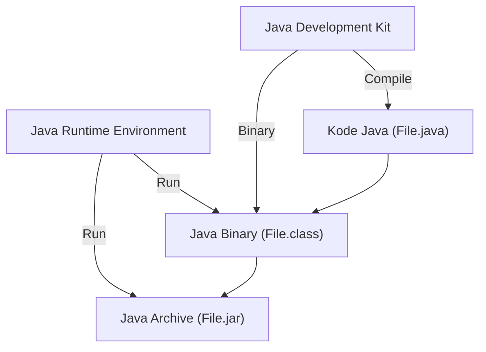

# Belajar Java Dasar

## Daftar Isi
- Pengenalan Java
- Instalasi Java
- Tipe Data di Java
- Operator
- Percabangan
- Perulangan
- Method

## Pengenalan Java

### Sejarah Java
- Java adalah bahasa pemrograman yang dibuat oleh James Gosling saat bekerja di Sun Microsystem
- Java dirilis ke publik pada tahun 1995 (open source)
- Java adalah bahasa pemrograman berorientasi objek dan mendukung pengelolaan memori secara otomatis
- Saat ini perusahaan Sun Microsystem telah dibeli oleh Oracle
- Java terkenal dengan write once, run anywhere, karena binary program Java di generate secara independen dan bisa dijalankan di Java Virtual Machine yang terinstal di berbagai sistem operasi

### Teknologi Java
- Java Standard Edition
- Java Enterprise Edition
- Java Micro Edition

### Dimana Java Banyak Digunakan ?
- Backend, banyak perusahaan besar saat ini menggunakan Java sebagai aplikasi backend nya seperti Twitter, Netflix, Spotify, Amazon, Alibaba, Blibli, dan lain - lain
- Big Data, teknologi - teknologi big data yang saat ini populer, kebanyakan adalah teknologi Java, seperti Apache Hadoop, Elasticsearch, Apache Cassandra, Apache Spark, Apache Kafka, dan lain - lain
- Android, di android kita bisa menggunakan Java dan Kotlin untuk membuat aplikasinya

### JRE VS JDK
- JRE singkatan dari Java Runtime Environment
- JDK singkatan dari Java Development Kit

### Java Virtual Machine
- Java sendiri hanyalah bahasa pemrograman, otak dibalik teknologi Java sebenarnya sebuah teknologi yang disebut Java Virtual Machine
- Java Virtual Machine merupakan program yang digunakan untuk mengeksekusi binary file Java
- Karena JVM hanya mengerti binary file, sehingga akhirnya banyak bahasa pemrograman yang mengadopsi teknologi JVM, seperti Kotlin, Scala, Groovy, dan lain - lain
- Dengan begitu, banyak bahasa pemrograman yang lebih canggih dari Java, namun mereka tetap jalan di JVM yang sudah terbukti stabil dan bagus

### Proses Development Program Java


## Instalasi Java

### JDK
- Open JDK (open source & gratis): https://openjdk.java.net/
- Oracle JDK: https://www.oracle.com/java/technologies/javase-downloads.html
- Amazon Correto: https://aws.amazon.com/id/correto/
- Zulu: https://www.azul.com/downloads/zulu-community/

### Setting Path
- Windows: https://medium.com/programmer-zaman-now/setting-java-path-di-windows-4da2c65d8298
- Linux atau Mac
```
# Add to .bashrc or .zshrc

export JAVA_HOME="/Library/Java/JavaVirtualMachines/jdk1.8.0_241.jdk/Contents/Home"
export PATH=$JAVA_HOME/bin:$PATH
```

### Integrated Development Environment
- IDE adalah smart editor yang digunakan untuk mengedit kode program
- IDE juga digunakan untuk melakukan otomatisasi proses kompilasi kode program dan otomatisasi proses menjalankan program

#### IDE untuk Java
- Intelli JDEA Ultimate / Community: https://www.jetbrains.com/idea/
- Eclipse: https://www.eclipse.org/downloads/packages/
- NetBeans: https://netbeans.apache.org/
- JDeveloper: https://www.oracle.com/application-development/technologies/jdeveloper.html

## Referensi
- https://www.youtube.com/watch?v=jiUxHm9l1KY&t=103s
